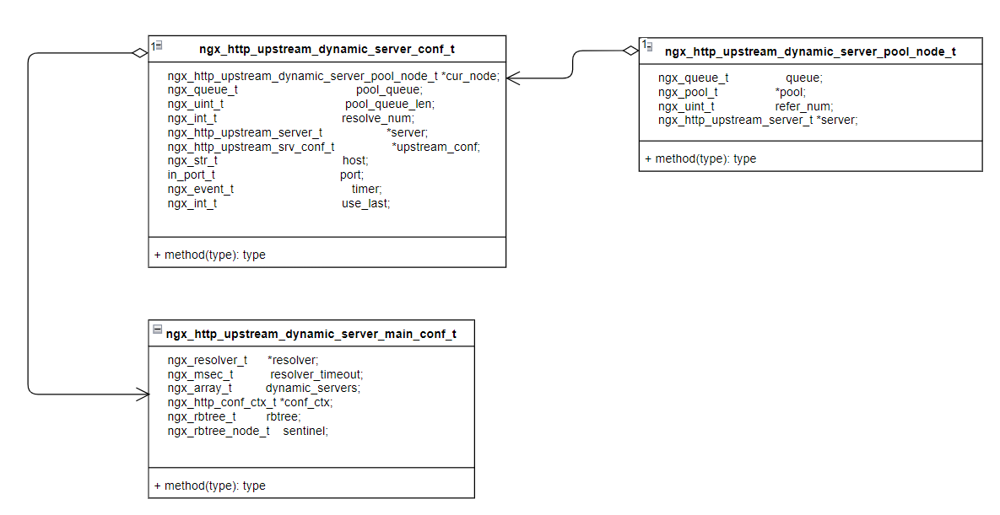
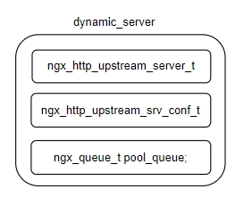
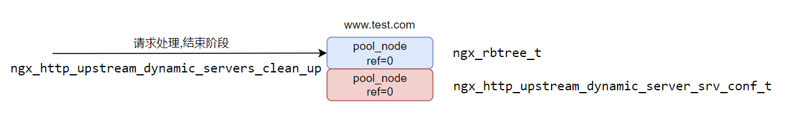
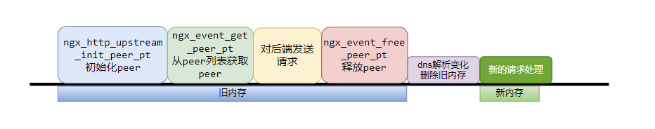

# 概要设计

## 处理流程

原先的处理流程：dns域名解析结果变化，不会转发至新的解析结果


新流程：dns域名解析结果变化，会更新upstream域名解析结果


# 详细设计

## 数据结构



### ngx_http_upstream_dynamic_server_conf_t的结构展示


每个ngx_http_upstream_dynamic_server_main_conf_t包含：

- dynamic_server的ngx_array_t
- rbtree记录每个upstream server的内存分配node
  - node：分配后端列表peer的内存块

### 每个dynamic_server的包含部分



### upstream与dynamic_server关系


每个ngx_http_upstream_dynamic_server_conf_t包含：

- pool_queue：内存分配的队列

ngx_http_upstream_dynamic_server_srv_conf_t包含：

- us_node：当前使用的peers后端内存分配node

## 流程处理


dns解析变化后调用ngx_http_upstream_init_round_robin初始化后端转发列表

```c
    dynamic_server->server->down = ctx->state ? 1 : 0;
    dynamic_server->server->addrs = addrs;
    dynamic_server->server->naddrs = ctx->naddrs;

    if (ngx_http_upstream_init_round_robin(
            &cf, dynamic_server->upstream_conf) != NGX_OK) {
        ngx_log_error(NGX_LOG_ERR, ctx->resolver->log, 0,
            "upstream-dynamic-servers: Error re-initializing "
            "upstream after DNS changes");
    }
    dynamic_server->upstream_conf->peer.init =
        ngx_http_upstream_init_dynamic_server_peer;
```

配置初始化阶段，构造节点

```c
        hash = ngx_crc32_short(dynamic_server->server->host.data,
            dynamic_server->server->host.len);
        node = ngx_http_upstream_dynamic_server_rbtree_lookup(
            &udsmcf->rbtree, hash, &dynamic_server->server->host);
        if (NULL == node) {
            size = offsetof(ngx_rbtree_node_t, color) +
                   sizeof(ngx_http_upstream_dynamic_server_pool_node_t *);
            node = ngx_pcalloc(cf->pool, size);
            if (node == NULL) {
                ngx_log_error(NGX_LOG_ERR, ngx_cycle->log, 0, "new node fail");
                return NGX_ERROR;
            }
            node->key = hash;
            ngx_rbtree_insert(&udsmcf->rbtree, node);
        }
```


定时器检测到dns变化，往构造节点填充pool_node内存节点信息

```c
    hash = ngx_crc32_short(
        dynamic_server->server->host.data, dynamic_server->server->host.len);
    node = ngx_http_upstream_dynamic_server_rbtree_lookup(
        &udsmcf->rbtree, hash, &dynamic_server->server->host);
    if (NULL != node) {
        node->key = hash;
        rbtree_node =
            (ngx_http_upstream_dynamic_server_pool_node_t **) &node->color;
        *rbtree_node = pool_node;
    } 
    udscf = ngx_http_conf_upstream_srv_conf(dynamic_server->upstream_conf,
        ngx_http_upstream_dynamic_servers_module);
    udscf->us_node = pool_node;
```


请求处理，init阶段，对ngx_http_conf_upstream_srv_conf的node引用计数+1
```c
    udscf = ngx_http_conf_upstream_srv_conf(
        us, ngx_http_upstream_dynamic_servers_module);
    udscf->us_node->refer_num++;
```


请求处理，获取peer阶段，对rbtree的pool_node引用计数+1

```c
        hash = ngx_crc32_short(pc->host->data, pc->host->len);
        node = ngx_http_upstream_dynamic_server_rbtree_lookup(
            &udsmcf->rbtree, hash, pc->host);
        if (NULL != node) {
            node->key = hash;
            rbtree_node =
                (ngx_http_upstream_dynamic_server_pool_node_t **) &node->color;
            pool_node = *rbtree_node;
            pool_node->refer_num++;         
        } 
```


请求处理，free peer阶段，对rbtree的pool_node引用计数-1

```c
        node->key = hash;
        rbtree_node =
            (ngx_http_upstream_dynamic_server_pool_node_t **) &node->color;
        pool_node = (*rbtree_node);
        if (NULL != pool_node) {
            ngx_uint_t refer_num = pool_node->refer_num;
            pool_node->refer_num = refer_num > 0 ? refer_num-- : 0;
        }
```


请求结束，对ngx_http_conf_upstream_srv_conf的node引用计数-1

```c
    ngx_uint_t refer_num = node->refer_num;
    node->refer_num = refer_num > 0 ? refer_num-- : 0;
```



# 问题分析

正常nginx处理流程：nginx单进程处理请求


当dns解析变化时，https://github.com/GUI/nginx-upstream-dynamic-servers.git方案流程是：



https://github.com/GUI/nginx-upstream-dynamic-servers.git访问当dns解析时机不对，会出现内存访问报错


https://github.com/zhaofeng0019/nginx-upstream-dynamic-resolve-servers.git 访问通过新增引用计数，解决内存问题


内存释放的代码：

```c
    for (p = pool_queue->next, n = p->next; p != pool_queue;
         p = n, n = n->next) {
        tmp_node = ngx_queue_data(
            p, ngx_http_upstream_dynamic_server_pool_node_t, queue);
        if (tmp_node->refer_num == 0) {
            ngx_queue_remove(p);

            ngx_log_debug(NGX_LOG_DEBUG_CORE, ngx_cycle->log, 0,
                "upstream-dynamic-servers: upstream host '%V' %ith pool "
                "will be destoried",
                &dynamic_server->upstream_conf->host, index);
            ngx_log_debug(NGX_LOG_DEBUG_CORE, ctx->resolver->log, 0,
                "destroy pool %p host:%s refer_num:%d", tmp_node,
                dynamic_server->server->host.data, tmp_node->refer_num);

            ngx_destroy_pool(tmp_node->pool);
            dynamic_server->pool_queue_len--;
        }
        index++;
    }

```

当upstream配置多个域名的时候，也会出现内存访问问题。内存结构是


分为peers使用的内存和peer使用的内存，是由不同的node分配而成，当出现并发访问时，会出现错误：

（图中内存有三段，分别是代表upstream中有三个域名时的内存情况，比如www.example.com对应第一段内存，www.test.com对应第二段内存)


最终流程：在**"ngx_event_get_peer_pt从peer列表获取peer"**时候根据针对peer使用的Node进行引用计数+1，**"ngx_event_free_peer_pt释放peer"**时引用计数-1，避免出现踩内存问题


