# High-Level Design

## workflow

The original process flow: When the DNS resolution results change, it does not forward to the new resolution results.

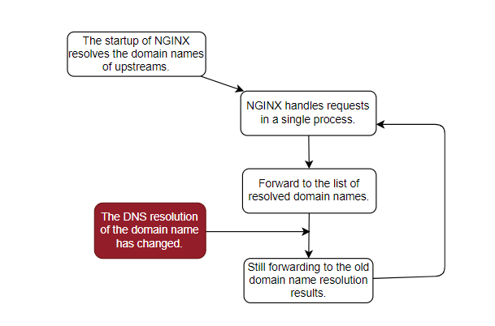

New process: When the DNS domain resolution results change, the upstream domain resolution results will be updated.

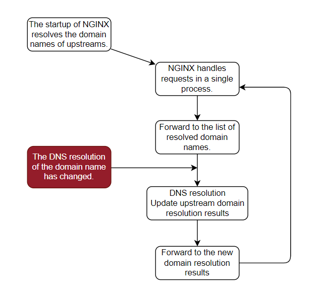

# Detailed Design

## Data Structures

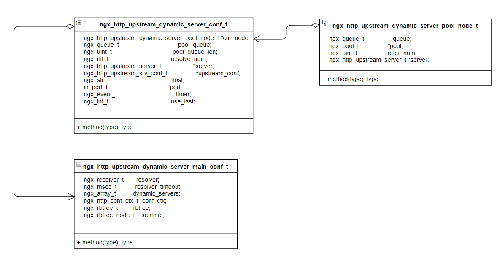

### Structure Display of `ngx_http_upstream_dynamic_server_conf_t`


Each `ngx_http_upstream_dynamic_server_main_conf_t` contains:

- An `ngx_array_t` for dynamic servers
- An `rbtree` that records memory allocation nodes for each upstream server
  - Node: Memory blocks allocated for backend peer lists

### Each `dynamic_server` contains:

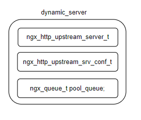

### Relationship between Upstream and Dynamic Server

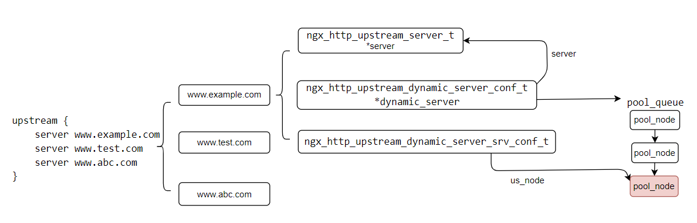

Each `ngx_http_upstream_dynamic_server_conf_t` contains:

- **pool_queue**: A queue for memory allocation.

Each `ngx_http_upstream_dynamic_server_srv_conf_t` contains:

- **us_node**: The memory allocation node for the currently used peers backend.

## Process Handling

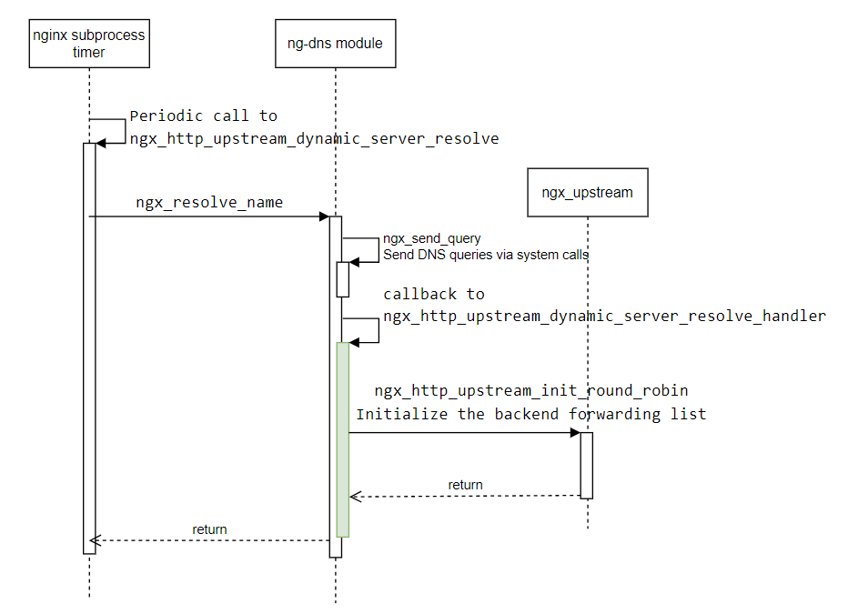

- After a change in DNS resolution, call `ngx_http_upstream_init_round_robin` to initialize the backend forwarding list.


```c
    dynamic_server->server->down = ctx->state ? 1 : 0;
    dynamic_server->server->addrs = addrs;
    dynamic_server->server->naddrs = ctx->naddrs;

    if (ngx_http_upstream_init_round_robin(
            &cf, dynamic_server->upstream_conf) != NGX_OK) {
        ngx_log_error(NGX_LOG_ERR, ctx->resolver->log, 0,
            "upstream-dynamic-servers: Error re-initializing "
            "upstream after DNS changes");
    }
    dynamic_server->upstream_conf->peer.init =
        ngx_http_upstream_init_dynamic_server_peer;
```

- During the configuration initialization phase, construct nodes.

```c
        hash = ngx_crc32_short(dynamic_server->server->host.data,
            dynamic_server->server->host.len);
        node = ngx_http_upstream_dynamic_server_rbtree_lookup(
            &udsmcf->rbtree, hash, &dynamic_server->server->host);
        if (NULL == node) {
            size = offsetof(ngx_rbtree_node_t, color) +
                   sizeof(ngx_http_upstream_dynamic_server_pool_node_t *);
            node = ngx_pcalloc(cf->pool, size);
            if (node == NULL) {
                ngx_log_error(NGX_LOG_ERR, ngx_cycle->log, 0, "new node fail");
                return NGX_ERROR;
            }
            node->key = hash;
            ngx_rbtree_insert(&udsmcf->rbtree, node);
        }
```

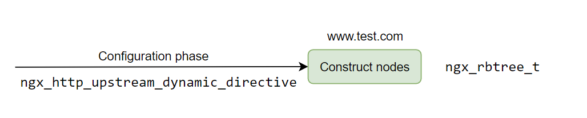

- When the timer detects DNS changes, populate the `pool_node` memory node information into the constructed nodes.


```c
    hash = ngx_crc32_short(
        dynamic_server->server->host.data, dynamic_server->server->host.len);
    node = ngx_http_upstream_dynamic_server_rbtree_lookup(
        &udsmcf->rbtree, hash, &dynamic_server->server->host);
    if (NULL != node) {
        node->key = hash;
        rbtree_node =
            (ngx_http_upstream_dynamic_server_pool_node_t **) &node->color;
        *rbtree_node = pool_node;
    } 
    udscf = ngx_http_conf_upstream_srv_conf(dynamic_server->upstream_conf,
        ngx_http_upstream_dynamic_servers_module);
    udscf->us_node = pool_node;
```

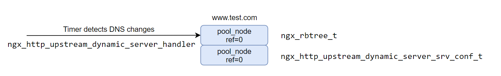

- Request handling, `init` phase: Increment the reference count of the `node` in `ngx_http_conf_upstream_srv_conf` by 1.

```c
    udscf = ngx_http_conf_upstream_srv_conf(
        us, ngx_http_upstream_dynamic_servers_module);
    udscf->us_node->refer_num++;
```

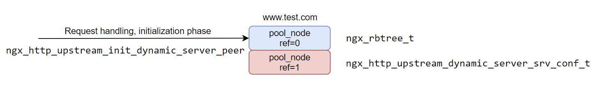

- Request handling, `get_peer` phase: Increment the reference count of the `pool_node` in the `rbtree` by 1.


```c
        hash = ngx_crc32_short(pc->host->data, pc->host->len);
        node = ngx_http_upstream_dynamic_server_rbtree_lookup(
            &udsmcf->rbtree, hash, pc->host);
        if (NULL != node) {
            node->key = hash;
            rbtree_node =
                (ngx_http_upstream_dynamic_server_pool_node_t **) &node->color;
            pool_node = *rbtree_node;
            pool_node->refer_num++;         
        } 
```

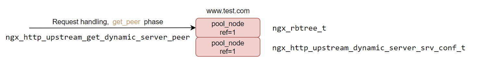

- Request handling, `free_peer` phase: Decrement the reference count of the `pool_node` in the `rbtree` by 1.


```c
        node->key = hash;
        rbtree_node =
            (ngx_http_upstream_dynamic_server_pool_node_t **) &node->color;
        pool_node = (*rbtree_node);
        if (NULL != pool_node) {
            ngx_uint_t refer_num = pool_node->refer_num;
            pool_node->refer_num = refer_num > 0 ? refer_num-- : 0;
        }
```

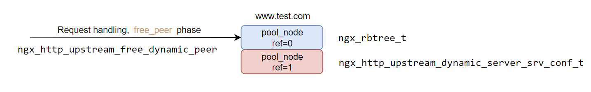

- At the end of the request: Decrement the reference count of the `node` in `ngx_http_conf_upstream_srv_conf` by 1.


```c
    ngx_uint_t refer_num = node->refer_num;
    node->refer_num = refer_num > 0 ? refer_num-- : 0;
```

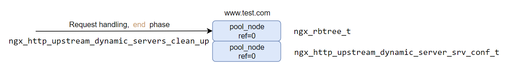

# Problem Analysis

Normal nginx handling flow: nginx processes requests in a single process.

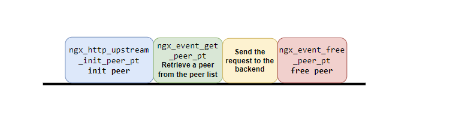

When DNS resolution changes, the process for the `https://github.com/GUI/nginx-upstream-dynamic-servers.git` solution is as follows:

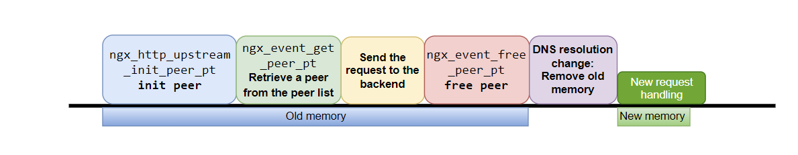

In the `https://github.com/GUI/nginx-upstream-dynamic-servers.git` solution, incorrect timing of DNS resolution updates can lead to memory access errors.

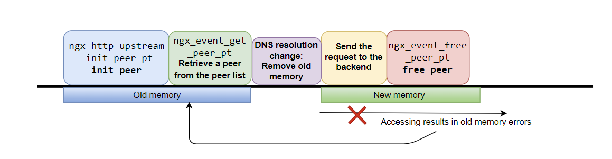

In the `https://github.com/zhaofeng0019/nginx-upstream-dynamic-resolve-servers.git` solution, memory issues are addressed by adding reference counting.

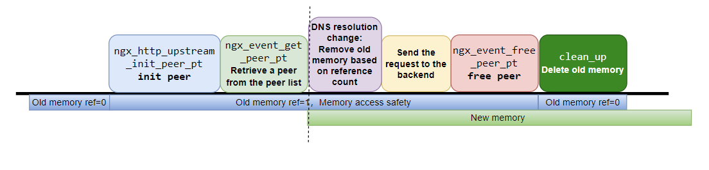

Memory deallocation code:

```c
    for (p = pool_queue->next, n = p->next; p != pool_queue;
         p = n, n = n->next) {
        tmp_node = ngx_queue_data(
            p, ngx_http_upstream_dynamic_server_pool_node_t, queue);
        if (tmp_node->refer_num == 0) {
            ngx_queue_remove(p);

            ngx_log_debug(NGX_LOG_DEBUG_CORE, ngx_cycle->log, 0,
                "upstream-dynamic-servers: upstream host '%V' %ith pool "
                "will be destoried",
                &dynamic_server->upstream_conf->host, index);
            ngx_log_debug(NGX_LOG_DEBUG_CORE, ctx->resolver->log, 0,
                "destroy pool %p host:%s refer_num:%d", tmp_node,
                dynamic_server->server->host.data, tmp_node->refer_num);

            ngx_destroy_pool(tmp_node->pool);
            dynamic_server->pool_queue_len--;
        }
        index++;
    }

```

When multiple domain names are configured in the upstream, memory access issues may also occur. The memory structure is:

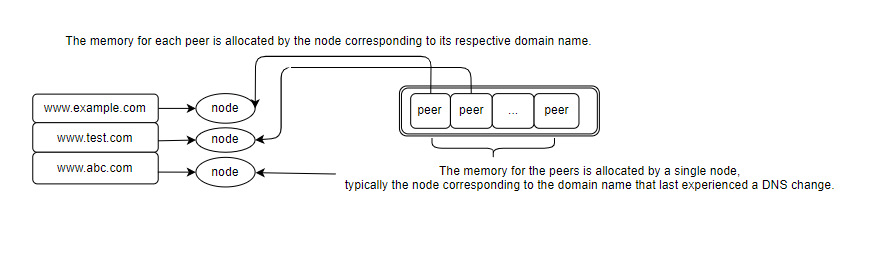

Memory is divided into the following:

1. **Memory for Peers**: Allocated by one node.
2. **Memory for Each Peer**: Allocated by a different node.

When concurrent access occurs, errors may arise due to the separation of memory allocation:

- Illustration

  : The memory is represented in three segments in the diagram. For instance:

  - The first segment represents the memory for `www.example.com`.
  - The second segment represents the memory for `www.test.com`.

Errors can occur when different nodes are responsible for managing different segments of memory, leading to potential conflicts or issues during concurrent access.

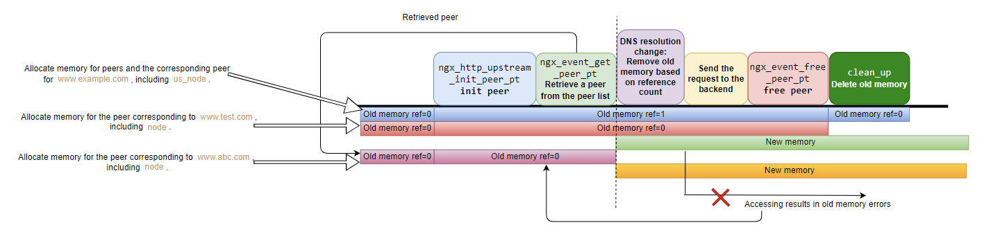

Final Process:

- During **"ngx_event_get_peer_pt"** when retrieving a peer from the peer list, increment the reference count based on the node used for the peer.
- During **"ngx_event_free_peer_pt"** when releasing a peer, decrement the reference count.

This approach helps avoid memory access issues by managing reference counts to prevent conflicts or errors related to memory usage.

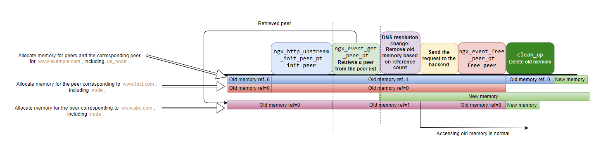


